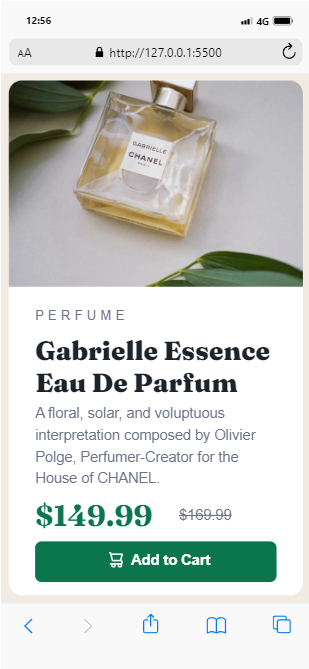

# Frontend Mentor - Product preview card component solution

This is a solution to the
[Product preview card component challenge on Frontend Mentor](https://www.frontendmentor.io/challenges/product-preview-card-component-GO7UmttRfa).
Frontend Mentor challenges help you improve your coding skills by building
realistic projects.

## Table of contents

- [Overview](#overview)
  - [The challenge](#the-challenge)
  - [Screenshot](#screenshot)
  - [Links](#links)
- [My process](#my-process)
  - [Built with](#built-with)
  - [What I learned](#what-i-learned)
  - [Continued development](#continued-development)
  - [Useful resources](#useful-resources)
- [Author](#author)
- [Acknowledgments](#acknowledgments)

## Overview

### The challenge

Users should be able to:

- View the optimal layout depending on their device's screen size
- See hover and focus states for interactive elements

### Screenshot



.png>)

### Links

- Solution URL:
  (https://github.com/Mubarak-Adeyemi/product-preview-card-component-main)
- Live Site URL:
  (https://mubarak-adeyemi.github.io/product-preview-card-component-main/)

## My process

### Built with

- Semantic HTML5 markup
- CSS custom properties
- Flexbox
- Mobile-first workflow For styles

### What I learned

During this project, I enhanced my skills in several key areas:

Semantic HTML5: I used semantic tags to provide clear structure and meaning to
the content, improving accessibility and SEO.

CSS Flexbox: Flexbox was used to create a flexible, responsive layout that
adapts well to different screen sizes.

CSS Custom Properties: I utilized CSS variables to create a consistent color
scheme and make future updates easier.

```html
<h1 class="product-title">Gabrielle Essence Eau De Parfum</h1>
```

```css
.product-card {
  width: 95%;
  display: flex;
  flex-direction: column;
  align-items: center;
  background-color: var(--White);
  border-radius: 1rem;
}
```

### Continued development

Moving forward, I plan to:

-Refine my CSS Flexbox skills: Continue exploring more complex layouts and
responsive design techniques with Flexbox. -Improve accessibility: Focus on
making web pages more accessible by using proper semantic elements and ARIA
attributes.

### Useful resource

CSS Tricks - A Complete Guide to Flexbox - This guide was instrumental in
helping me understand Flexbox and how to implement it effectively.

## Author

- Frontend Mentor -
  [@Mubarak-Adeyemi](https://www.frontendmentor.io/profile/Mubarak-Adeyemi)
- Twitter -
  [@mubaralElharabiy](https://x.com/mubarakElarabiy?t=dIaedCkOJLk9K0-tB1tS9w&s=09)

## Acknowledgments

Thanks to Frontend Mentor for providing this challenge, and to the community for
offering feedback and support during the development process.
